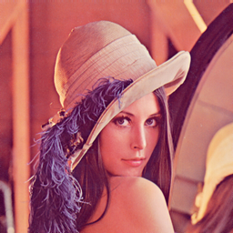
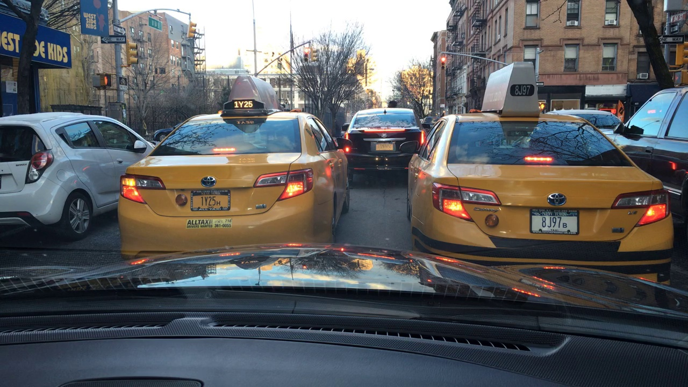
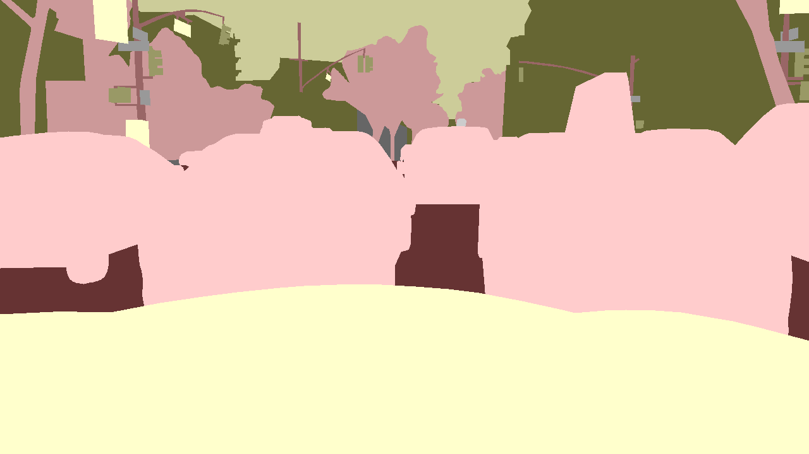
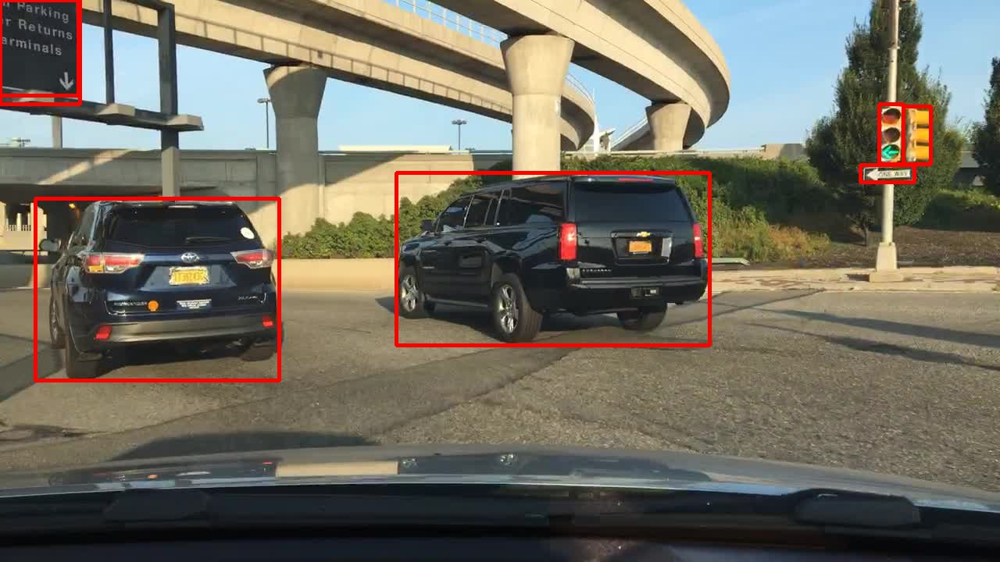
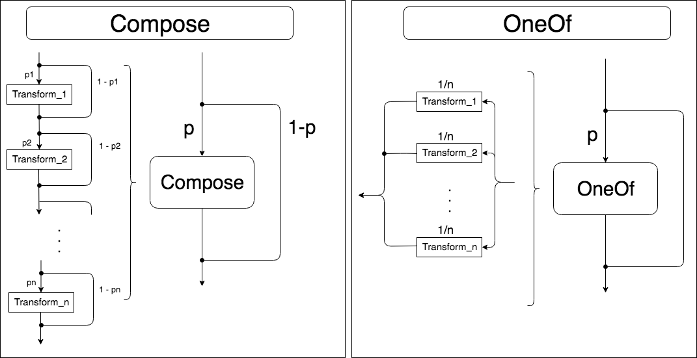
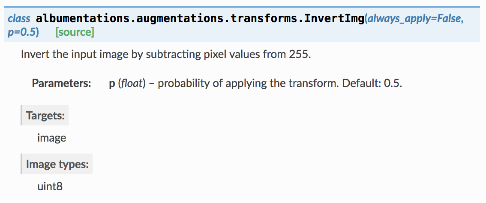
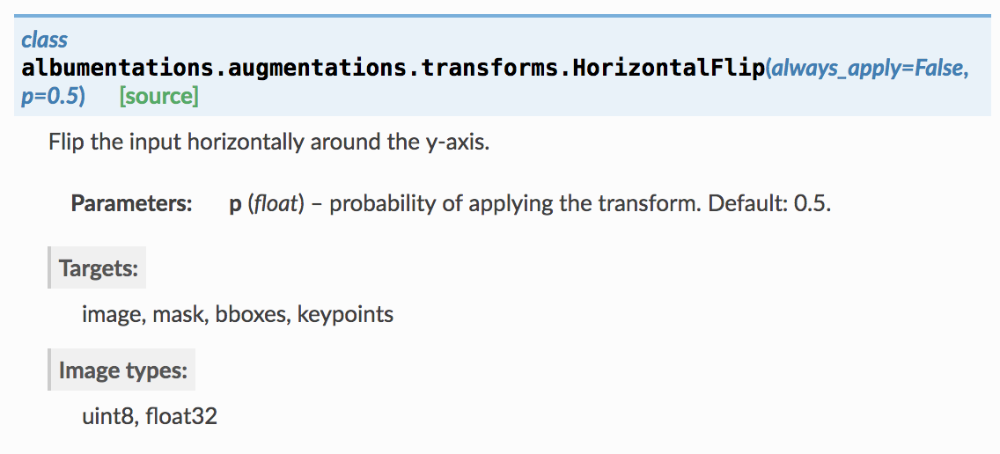

# Tour of Albumentations

このレポジトリは、albumentationsのtransformsクラスを主にまとめたものになります。

間違い等ございましたら　[@katsura_jp](https://twitter.com/katsura_jp)　までお願いします。

著者のブログは [こちら](http://katsura-jp.hatenablog.com/about)


## Albumentationsとは？
画像処理ライブラリを内部で使用している高速な画像augmentationライブラリ
## 特徴
- OpenCVをベースにした高速な拡張
- セグメンテーションや物体検出等の様々なタスクのためのシンプルなインターフェース
- カスタマイズが容易
- 他のフレームワークの追加が容易

## インストール方法
pipでインストール

>`pip install albumentations`

最新版をインストールするには

>`pip install -U git+https://github.com/albu/albumentations`

## Document
https://albumentations.readthedocs.io/en/latest/


## 使用する画像
Lennaの画像とBDD100Kのsegmentationとdetectionのデータを使います。







## バウンディングボックスのフォーマットについて
このライブラリでは、バウンディングボックスを取り扱うにあたり、3種類のバウンディングボックスの形式を定義しています。
### 1. coco

    MS COCOで扱われているバウンディングボックスのアノテーション。 
    ```
    [x_min, y_min, width, height]
    ```
    の順番であり、ボックスの左上の頂点の座標とそこからのx軸y軸それぞれの長さとなっている。
### 2. pascal_voc

    Pascal VOCで扱われているバウンディングボックスのアノテーション。
    ```
    [x_min, y_min, x_max, y_max]
    ```
    の順番であり、ボックスの左上の頂点の座標と右下の頂点の座標となっている。
### 3. albumentations

    albumentations内で処理される時の独自フォーマット。
    ```
    [x_min, y_min, x_max, y_max]
    ```
    の順番で、Pascal VOCと順番は変わらないが、座標が画像サイズで正規化されているため、それぞれが0から1までの数値となっている。


### フォーマットの変換方法

フォーマットの変換は、

- albumentations.augmentations.bbox_utils.convert_bbox_to_albumentations

- albumentations.augmentations.bbox_utils.convert_bbox_from_albumentations

を使用します。（下記で触れるCompositionでは、内部で勝手に変換されるので、フォーマットだけ与えてください）


#### pascal vocからalbumentations

`bboxes`をpascal vocのフォーマットのバウンディングボックスとし、元の画像をimageとします。

```python
convert_bboxes_to_albumentations(bboxes=bboxes, source_format='pascal_voc', rows=image.shape[0], cols=image.shape[1], check_validity=False)
```

#### albumentationsからpascal voc

`bboxes`をalbumentationsのフォーマットのバウンディングボックスとし、元の画像をimageとします。

```python
convert_bboxes_from_albumentations(bboxes=bboxes, target_format='pascal_voc', rows=image.shape[0], cols=image.shape[1], check_validity=False)
```


詳しくは、[こちら](https://albumentations.readthedocs.io/en/latest/api/augmentations.html#module-albumentations.augmentations.bbox_utils)


## Composition

Compositionは、画像を変換する際に変換するアルゴリズムのリストを引数に渡すことで、簡単に画像を変換できるようにするジェネレータです。実際に学習等でこのライブラリを使用する場合は、こちらを使用することが基本となります。下で説明するAugmentationクラスを簡単に組み合わせることが可能です。

詳しくは、[こちら](https://albumentations.readthedocs.io/en/latest/api/core.html)を参照してください。

また、Interfaceは、次に説明するTransformsの継承元として使用されているので、オリジナルのAugmentationクラスを作成する時は使うと良いと思います。


### Composition一覧
- Compose : リストを順に適用していく
- OneOf : リストの中から1つを選択し適用していく



Composeの内部にOneOfを入れることで、より柔軟に画像をランダムに変換できます。

## Augmentation
実際の変換アルゴリズム

詳しくは[こちら](https://albumentations.readthedocs.io/en/latest/api/augmentations.html)を参照してください。

### Augmentationsの一覧
- Transforms : 変換ジェネレータ(`__call__`の内部でFunctional transformsが呼び出されています)
- Functional transforms : 変換関数
- Helper functions for working with bounding boxes : バウンディングボックスの扱いに便利な関数

### Transformsの一覧

### Blur系
1. Blur
1. MotionBlur
1. MedianBlur
1. GaussianBlur

### Flip系
1. VerticalFlip
1. HorizontalFlip
1. Flip

### Rotate系
1. Transpose
1. RandomRotate90
1. Rotate
1. ShiftScaleRotate

### Crop&Scale系
1. RandomCrop
1. ShiftScaleRotate (Rotate系に記載)
1. CenterCrop
1. PadIfNeeded
1. Crop
1. RandomScale
1. LongestMaxSize
1. SmallestMaxSize
1. Resize
1. RandomSizedCrop
1. RandomCropNearBBox
1. RandomSizedBBoxSafeCrop

### Distortion系
1. OpticalDistortion
1. GridDistortion
1. ElasticTransform

### 色変換系
1. CLAHE
1. InvertImg
1. RandomGamma
1. ChannelShuffle
1. HueSaturationValue
1. RGBShift
1. RandomBrightnessContrast
1. RandomBrightness
1. RandomContrast
1. ToGray

### ノイズ系
1. GaussNoise
1. Cutout

### その他
1. Normalize
1. JpegCompression
1. ToFloat
1. FromFloat
1. (Lambda)
1. RandomSnow
1. RandomRain
1. RandomFog
1. RandomSunFlare
1. RandomShadow
1. (ToTensor)

## 補足
引数に`always_apply`というのがありますが、これはp=1と同義です。
`p=0`でも`always_apply=True`であれば、transformsは呼ばれます。

また、composition, transformsどちらも一部を除き、callable引数は`image, mask, bboxes, keypoints`が基本となります。返り値は引数に渡した引数のkeyのdict(例えば、`image, mask, bboxes`を渡した場合、{'image': np.array, 'mask': np.array, 'bboxes: list))で変換後の値がvalueとして得られます。

## Documentの読み方



TransformsのDocumentは上の画像のように書かれています。Targetsとは、インスタンス化したtransformsクラスをイテレータで呼び出す際の引数です。左図ではimageのみなので、画像のみを変換します。
対して、右図ではimage,mask,bboxes,keypointsも変換されます。こちらは、segmentationやdetectionといったタスクで簡単にaugmentationすることが可能となります。sourceを覗くと、この二つのような違いは、それぞれ継承元が、ImageOnlyTransformかDualTransformかに依存していることがわかります。右図のようなクラスに対しては、image以外の引数は必須ではありません。segmentationの場合はmaskのみや、detectionの場合はbboxesのみに与えるように柔軟に変えることが可能です。

targetがimageのみだからといって、引数にmaskは与えられない分けではなく、その場合は、変換を実際にする関数にmaskは渡されることなく実行されるのでmaskに対して
変化はありません。

Image typesは入力画像の型指定になるので、左図のInvertImgクラスにはfloat32(0~1に正規化)の画像を与えることはできません。(全てを確認したわけではないですが、正規化前であればfloat32でもInvertImg等は動きます)
